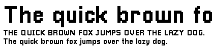
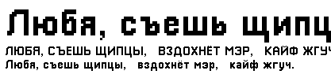

# Pixellari Cyrillic

A simple pixel font that's 100% free to use, now with Cyrillic characters support. The only thing I ask for is credit for me and the original author, if possible.

Created on 2017-01-07 using the awesome free font-making tool, [BitFontMaker 2](http://www.pentacom.jp/pentacom/bitfontmaker2/).

Edited on 2021-03-13 using the same tool to add Cyrillic characters as I didn't want to see default Roboto font fallback in the game I anticipated.

If you're looking to download the original font, please consider downloading from [Dafont][font-link] if possible, as it makes it more popular on the website. :)

### [Link][font-link]

## Known Usages
###### *go check em out!*

- **[A Short Hike](http://ashorthike.com/)**
- **[Overkill Software's PAYDAY 2 Text Adventure](https://www.overkillsoftware.com/pdtextadventure/index.php)**
- **[Mulligamez' Sub Shooter](https://mulligamez.itch.io/sub-shooter)**
- **[Lyutria's Aseprite Studio Theme](https://github.com/Lyutria/aseprite-studio-theme)**
- **[WickedHardcorg & ChevronElephant's *Three Dog Night*](https://rpgmaker.net/games/9975/)**
- **[Droneburn Minecrash](https://www.newgrounds.com/portal/view/750379)**
- **[Incompleted](https://oncgm.itch.io/incompleted)**
- **[XZ - 03](https://bocodillo.itch.io/xz-03)**
- **[Too Many Cooks!](https://bocodillo.itch.io/too-many-cooks)**
- **[Flashcard Dungeon](https://benjaminnolan.itch.io/flashcard-dungeon)**
- **[Pixel Space Shooter](https://tarcisiotm.itch.io/pixel-space-shooter)**
- **[Circuit Rush](https://lucky89-games.itch.io/circuit-rush)**
- **[Pixel Fishing](https://play.google.com/store/apps/details?id=com.irchit_dev.pixelfishing&hl=en_US)**
- **[Robert Myers' Moxybox](https://robertjaymyers.github.io/apps/moxybox-game.html)**
- **[Intravenous](https://store.steampowered.com/app/1486630/Intravenous/)** (Cyrillic variant; the font edit was initially made for this game)

*...and more!*

###### if you've used it in a project and you'd like me to include your project here, feel free to send me a message!

[font-link]: https://www.dafont.com/pixellari.font
